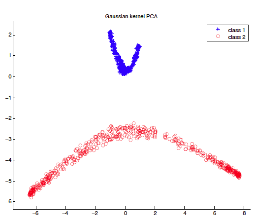

# Kernel PCA and Pre-Image Reconstruction [](https://www.mathworks.com/matlabcentral/fileexchange/39715-kernel-pca-and-pre-image-reconstruction) [](https://arxiv.org/pdf/1207.3538.pdf)

## Overview

In this package, we implement standard PCA, kernel PCA, and pre-image reconstruction of Gaussian kernel PCA.

We also provide three demos:
1. Two concentric spheres embedding;
2. Face classification with PCA/kPCA;
3. Active shape models with kPCA.

Standard PCA is not optimized for very high dimensional data. But our kernel PCA implementation is very efficient, and has been used in many research projects.

This library is also available at MathWorks:
* https://www.mathworks.com/matlabcentral/fileexchange/39715-kernel-pca-and-pre-image-reconstruction



## Citations

If you use this library, please cite:

```
@article{wang2012kernel,
  title={Kernel principal component analysis and its applications in face recognition and active shape models},
  author={Wang, Quan},
  journal={arXiv preprint arXiv:1207.3538},
  year={2012}
}
```
